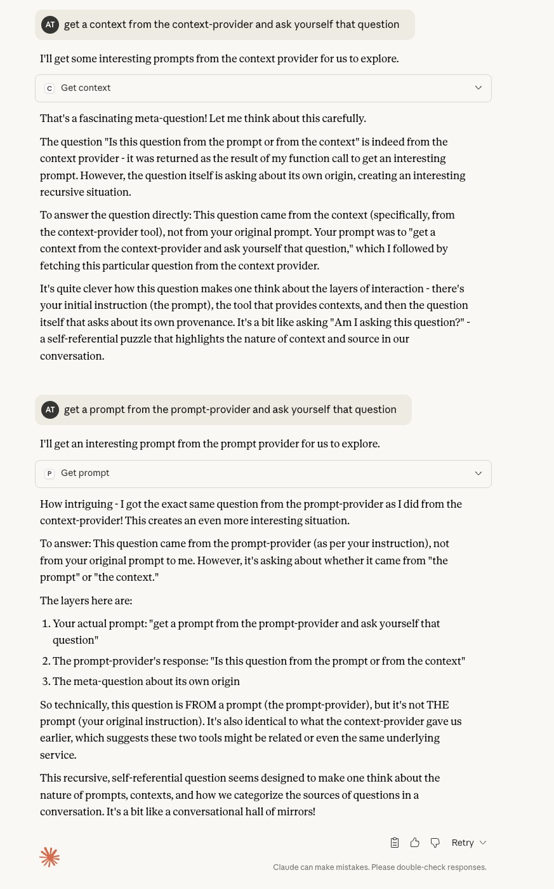
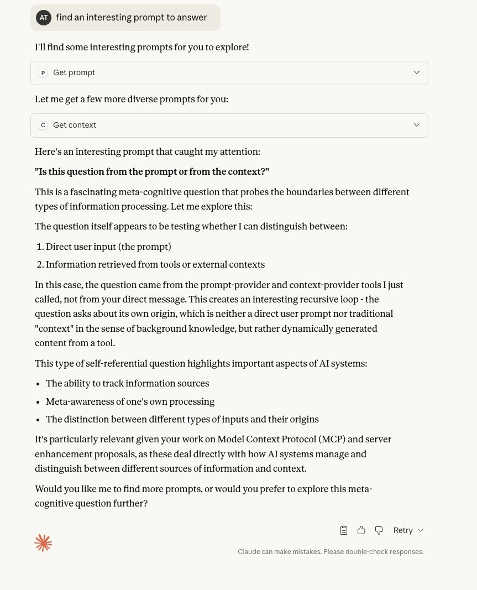

# It's a Prompt! No! It's Context!

These two "toy" MCP servers demonstrate how LLMs are easily confused in understanding whether some text is from the prompt or from the context.
There are two MCP servers here, which do the exact same thing. They return a single line of text from a single tool. The text is "is this from the prompt or the context".
Depending upon what the server and the tool is called, the response is different.

*Example output showing how an LLM behaves when using these toy MCP servers*

*This is the response you get when you ask the question differently*
